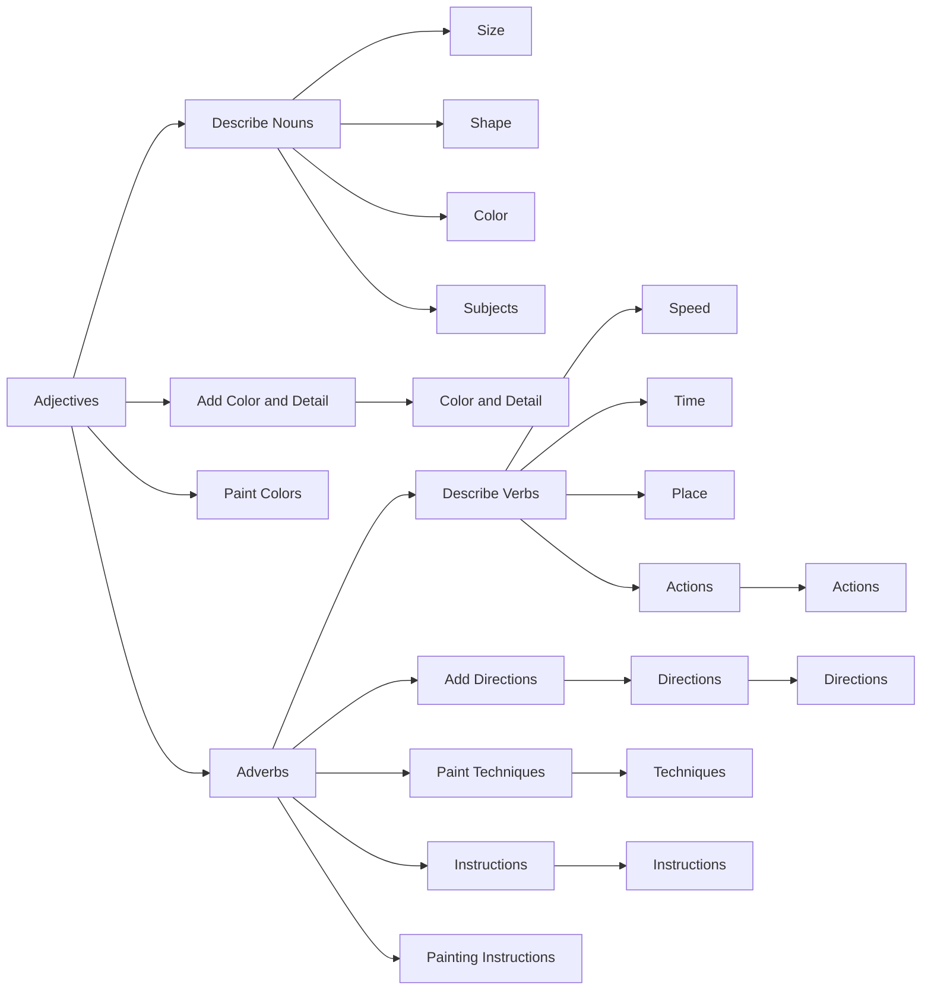

# Adjectives x Adverbs in English

## Adjectives

Imagine you're painting a picture. An adjective is like a brush that adds color and detail to your subject. For example, if you're painting a picture of a dog, an adjective like "big" would help you describe its size, making it stand out in your painting.

Here's a simple analogy:

- Adjectives are like paint colors.
- Nouns are like the subjects you're painting.

## Adverbs

Now, let's think about adverbs. They're like directions or instructions that tell us how to paint or what to do with our paint. For example, if you're painting a picture of a dog running, an adverb like "quickly" would help you describe the speed of the dog's action, making it more interesting in your painting.

Here's a simple analogy:

- Adverbs are like painting techniques or directions.
- Verbs are like the actions you're painting.

